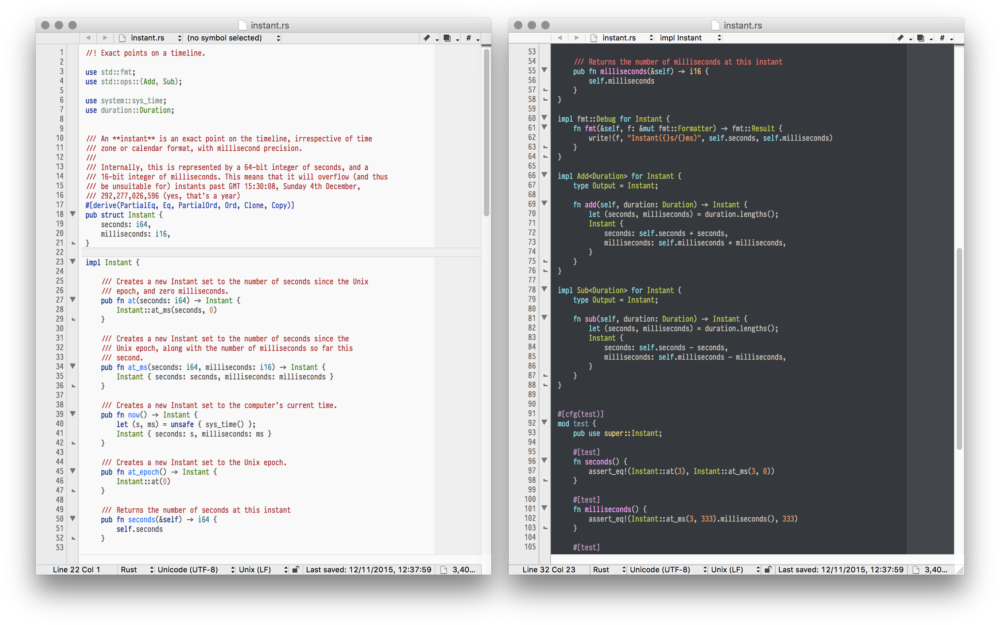

BBEdit Package for Rust
=======================



This is a BBEdit 11 Package for [Rust](http://www.rust-lang.org). It provides the following features:

- Complete syntax highlighting
    - Special support for lifetimes, attributes, and identifiers
    - Customisable colours using the [BBEdit 11 colour editor](http://barebones.com/products/bbedit/bbedit11.html)
- Language features
    - Go to start of/end of/previous/next function
    - Go to symbol
    - [Find in Reference support](https://github.com/ogham/Rust-BBEdit/wiki/Find-in-Reference)
    - Indexed function menu
    - Code folding
- Integration and helpers
    - [Rustdoc preview](https://github.com/ogham/Rust-BBEdit/wiki/Rustdoc-Preview) to check your docs’ Markdown syntax
    - Clippings for common code patterns
    - [Implementation generator](https://github.com/ogham/Rust-BBEdit/wiki/impl-Generator) for standard library traits
    - [TOML support](https://github.com/ogham/Rust-BBEdit/wiki/TOML) for Cargo and suchlike
    - [rustfmt support](https://github.com/ogham/Rust-BBEdit/wiki/rustfmt)
    - [Cargo build scripts](https://github.com/ogham/Rust-BBEdit/wiki/Cargo)

See the Wiki pages for more information and screenshots.


### Installation

To install this package, simply clone the repo into BBEdit’s Packages folder:

```bash
$ git clone https://github.com/ogham/Rust-BBEdit.git ~/Library/Application\ Support/BBEdit/Packages/Rust.bbpackage
```

Then restart your BBEdit and it should be picked up. It’s necessary for the filename to end in `.bbpackage`.

Alternatively, just [download this .zip of the source](https://github.com/ogham/Rust-BBEdit/archive/master.zip) and extract it to that directory.


### Compilation

To compile your own version, you’ll need Xcode, Rust, and Cargo. The default schema outputs a `.bblm`, and comes with a Run build step so you can debug the module while BBEdit is running. You’ll also need the [BBEdit SDK](http://www.barebones.com/support/develop/). The project assumes it’s mounted under `/Volumes/BBEdit SDK`.

Once you’ve got all that set up, simply run `make` and it’ll compile the language module and Rust helper tools for you.

Note that compiled versions of these tools already exist in the repository—you won’t be generating anything that doesn’t already exist!
